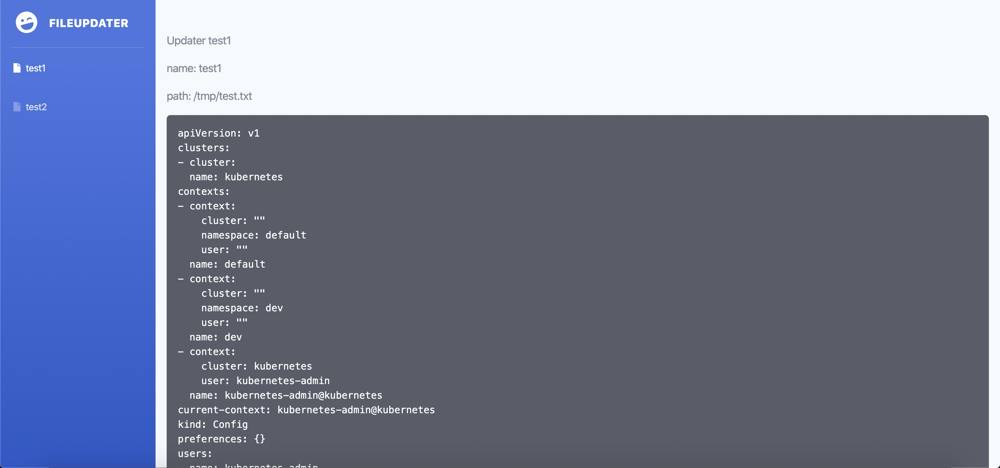

# fileUpdater 


The file updater helps you use a web page with an editor to update your files and trigger the related command hook.
Just a signle binary file (thanks golang!)


## features
* easy deploy (single binary file)
* pre command hook
* post command hook
* auto backup
* daemon
* update itself
* low memory require
* exec shell command

## How to use it

>| Linux

1, get the binary
```bash
wget https://github.com/GoSome/fileUpdater/releases/download/v0.1/fileupdater-amd64-linux
chmod +x fileupdater-amd64-linux
```
2, create simple config

config.yaml
```yaml

server_port: "8080"
server_host: "0.0.0.0"
updaters:
  - name: test1
    path: /tmp/test.txt
    backup: false
    pre_hook:
      mode: strict
      commands:
        - ls -lha

```

3, just run

```yaml
./fileupdater-amd64-linux -i -config config.yaml
```
## UI




## Hook Seq

```bash
PRE -> WRITE -> POST
```
